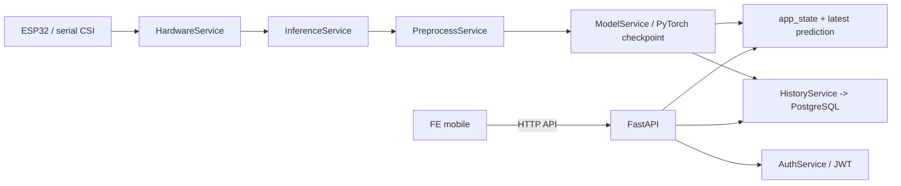

# README - Luong hoat dong cua ung dung

## 1. Tong quan

Day la he thong theo doi su hien dien cua con nguoi trong phong dua tren du lieu CSI (Channel State Information) lay tu ESP32. He thong gom 2 phan chinh:

- FE mobile: giao dien cho nguoi dung, hien thi trang thai he thong, ket qua du doan, lich su va dang nhap/dang ky.
- BE: nhan du lieu tu ESP32, xu ly du lieu, goi model PyTorch de suy luan, luu lich su du doan va phuc vu API cho FE.

Muc tieu cua he thong la phat hien su hien dien cua nguoi dung trong moi truong trong thoi gian thuc, dong thoi cung cap giao dien de quan sat trang thai he thong, dich vu API va lich su du doan.

## 2. Cong nghe su dung

### FE

- Expo Router / React Native
- TypeScript
- AsyncStorage de luu access token
- Expo Constants de suy ra dia chi API
- Zod de validate form dang ky

### BE

- FastAPI
- SQLAlchemy
- PostgreSQL
- PyTorch
- NumPy, SciPy
- PySerial de doc du lieu tu cong serial
- python-jose de tao va giai ma JWT

### Model

- Kien truc dung trong code la LSTM-CNN classifier
- Checkpoint model mac dinh: models/lstmcnn.pt

## 3. Muc dich cua FE va BE

### FE

- Hien thi dashboard realtime cho nguoi dung.
- Goi API de lay trang thai he thong, du doan gan nhat, lich su va cac thao tac dang nhap/dang ky.
- Luu access token sau khi dang nhap thanh cong.
- Poll backend dinh ky de cap nhat du lieu moi nhat.

### BE

- Quan ly ket noi voi thiet bi ESP32 qua serial.
- Nhan, lam sach va tien xu ly CSI truoc khi dua vao model.
- Suy luan du doan presence / no_person tu model.
- Luu ket qua vao co so du lieu.
- Tra ve API cho FE va cho cac client khac neu can.

## 4. Kien truc tong the



## 5. Luong xu ly du lieu o BE

### 5.1. Lay du lieu tu ESP32

BE khong nhan du lieu truoc tu FE. Du lieu CSI duoc doc truc tiep tu cong serial boi `HardwareService`.

Quy trinh:

  DBH[(prediction_history)]
  CTRL --> DBU
  FE --> AUTH
  AUTH --> CTRL
  CTRL --> HS
  HS --> INF
  INF --> PRE --> MODEL --> STATE
  HS --> DBS
  INF --> DBH
  STATE --> STATUS
  STATUS --> FE
  AUTH --> DBU
  CTRL --> DBU
- `feature_dim`
- so lop phan loai
- ten nhan neu checkpoint co `class_names`

Khi can du doan:

1. `PreprocessService.process()` tra ve ma tran da tien xu ly.
2. `ModelService.predict()` chuyen du lieu sang tensor PyTorch.
3. Model LSTM-CNN tinh logits.
4. Softmax duoc ap dung de lay xac suat tung lop.
5. Ket qua tra ve gom:
   - `presence`
   - `confidence`
   - `probability`

### 5.5. Luu ket qua va cap nhat trang thai

Sau khi co prediction:

- Gan vao `app_state.latest_prediction`
- Danh dau `app_state.model_loaded = True`
- Them vao `history_service.add()`

`HistoryService` luu du lieu vao bang `prediction_history` trong PostgreSQL duoi dang JSON, kem thoi gian tao ban ghi.

## 6. BE giao tiep voi FE nhu the nao

FE giao tiep voi BE qua HTTP REST API.

### 6.1. Cach FE tim dia chi backend

Trong `fe/mobile/services/api.ts`:

- Neu co `EXPO_PUBLIC_API_BASE_URL`, FE se dung gia tri nay.
- Neu khong, FE lay tu `app.json` / Expo config extra.
- Neu van khong co, FE tu suy ra host tu Expo runtime va mac dinh ve `http://127.0.0.1:8000/api`.

### 6.2. Cac API FE dang dung

- `GET /api/status` de lay trang thai backend, monitoring, model_loaded va thong tin ket noi thiet bi.
- `GET /api/latest` de lay prediction moi nhat.
- `POST /api/control/start` de bat dau monitoring.
- `POST /api/control/stop` de dung monitoring.
- `GET /api/history?limit=100` de lay lich su du doan.
- `POST /api/auth/register` de dang ky.
- `POST /api/auth/login` de dang nhap.
- `GET /api/auth/user/me` de lay thong tin user hien tai.

### 6.3. Cach FE xu ly du lieu tra ve

FE co mot lop trung gian la `api.ts`:

- Tu dong them header `Content-Type: application/json`.
- Neu da dang nhap, tu dong them `Authorization: Bearer <token>`.
- Doc `accessToken` tu `AsyncStorage`.
- Chuan hoa ket qua prediction ve mot format thong nhat co `presence`, `confidence`, `probabilities`, `timestamp`.

### 6.4. Luong tren man hinh Home

`home.tsx` dang lam 2 viec chinh:

1. Goi song song `GET /api/status` va `GET /api/latest`.
2. Poll lai moi 2 giay de cap nhat trang thai realtime.

Tu trang Home, nguoi dung co the:

- bat/dung monitoring
- xem ket qua hien tai
- xem do tin cay AI
- di sang man hinh lich su

### 6.5. Luong dang nhap / dang ky

- `register.tsx` gui du lieu dang ky qua `api.register()`.
- `login.tsx` gui email/password qua `api.login()`.
- Sau khi login thanh cong, FE luu `accessToken` vao `AsyncStorage`.
- Cac request sau do se tu dong mang token nay de truy cap endpoint can xac thuc.

## 7. API backend quan trong

### 7.1. `GET /api/status`

Tra ve trang thai he thong:

- backend co dang chay khong
- model da load chua
- feature_dim hien tai
- trang thai monitoring
- thong tin ket noi ESP32 va serial

### 7.2. `GET /api/latest` va `GET /api/lastest`

Tra ve prediction gan nhat trong `app_state.latest_prediction`.

Neu chua co du lieu, backend tra ve trang thai khong thanh cong voi thong diep `No data available`.

### 7.3. `POST /api/predict`

Endpoint nay nhan mot `window` CSI duoi dang mang 2 chieu.

Backend se:

1. Kiem tra shape cua window.
2. Kiem tra so feature co dung voi model khong.
3. Tien xu ly du lieu.
4. Goi model de du doan.
5. Luu prediction vao history.

Day la duong API huu ich neu FE hoac client khac muon gui mot cua so CSI co san, khong can dien qua serial realtime.

### 7.4. `POST /api/control/start` va `POST /api/control/stop`

- Start: tao `monitoring_session` moi, bat dau doc serial va chay monitoring realtime.
- Stop: dung doc serial, dong session trong DB va cap nhat trang thai monitoring.

### 7.5. `GET /api/history`

Tra ve danh sach prediction da luu, mac dinh toi da 100 ban ghi.

### 7.6. `POST /api/auth/register` va `POST /api/auth/login`

- Register: tao user moi, hash mat khau bang PBKDF2-HMAC-SHA256.
- Login: xac thuc user, sau do tao JWT access token.

### 7.7. `GET /api/auth/user/me`

Endpoint nay can JWT Bearer token hop le de tra ve thong tin user hien tai.

## 8. Du lieu duoc xu ly va luu nhu the nao

### Input thuc te

- Du lieu gui tu ESP32 duoc doc tu serial.
- Moi dong co the chua device id va danh sach gia tri CSI.

### Validation

- Loai packet loi parse.
- Loai packet co thieu feature.
- Cat bot packet neu so feature vuot qua `feature_dim`.

### Processing

- Gom mau vao buffer.
- Tao cua so du doan co do dai co dinh.
- Tien xu ly tren tung window.
- Dua window vao model de lay xac suat tung lop.

### Output

Moi prediction co dang:

- `presence`
- `confidence`
- `probability`
- `timestamp`

Ket qua duoc luu vao:

- `app_state.latest_prediction` de FE lay realtime
- bang `prediction_history` de tra cuu lich su

## 9. Cai dat can biet

### Bien moi truong backend

- `DATABASE_URL`: chuoi ket noi PostgreSQL.
- `MODEL_PATH`: duong dan checkpoint model.
- `WINDOW_SIZE`: kich thuoc cua so du doan.
- `STEP_SIZE`: so mau de cap nhat mot lan du doan.
- `FEATURE_DIM`: so feature moi mau CSI.
- `SERIAL_PORT`: cong serial cua ESP32.
- `SERIAL_BAUDRATE`: toc do serial.

### FE mobile

- `EXPO_PUBLIC_API_BASE_URL`: neu muon FE tro truc tiep ve backend theo dia chi co dinh.
- Neu khong co, FE se tu suy ra host trong moi truong Expo.

## 10. Ghi chu ve hien tai cua source

- FE hien tai dung polling HTTP, khong dung websocket.
- Backend co file websocket, nhung chua thay duoc noi vao flow FE hien tai.
- Route `latest` co them alias `lastest` de tuong thich voi code cu.
- He thong hien tai tap trung vao do du doan presence realtime va luu history.

## 11. Tom tat luong chay

1. ESP32 gui du lieu CSI qua serial ve backend.
2. Backend doc tung dong, parse va kiem tra so feature.
3. Du lieu hop le duoc dua vao buffer va gom thanh window.
4. Window duoc tien xu ly bang Hampel, Butterworth va normalization.
5. Model LSTM-CNN duoc goi de suy luan.
6. Prediction duoc luu vao `app_state` va PostgreSQL.
7. Khi nguoi dung bam Start, backend tao mot monitoring session trong DB va bat dau doc serial.
8. FE goi `GET /status` va `GET /latest` de hien thi realtime trong khi session dang active.
9. FE co the xem `GET /history` va thuc hien login/register qua API auth.

## 12. Cấu trúc hiện tại của hệ thống

He thong hien tai co the hieu theo 5 lop chinh:

1. Lop giao dien FE: nhan login, hien thi dashboard, history, profile va trang thai realtime.
2. Lop xac thuc: luu JWT trong AsyncStorage, hydrate session khi app mo lai, chong truy cap route protected neu chua dang nhap.
3. Lop dieu khien monitoring: `control/start` va `control/stop` tao dong bo voi session DB.
4. Lop xu ly du lieu: `HardwareService` doc serial, `InferenceService` gom mau, `PreprocessService` lam sach, `ModelService` suy luan.
5. Lop du lieu DB: `users`, `monitoring_sessions`, `prediction_history`.

```mermaid
flowchart TD
   FE[FE mobile]\n+  AUTH[AuthProvider / JWT]\n+  CTRL[POST /control/start-stop]\n+  HS[HardwareService]\n+  INF[InferenceService]\n+  PRE[PreprocessService]\n+  MODEL[ModelService]\n+  STATE[app_state]\n+  STATUS[GET /status /latest]\n+  DBU[(users)]\n+  DBS[(monitoring_sessions)]\n+  DBH[(prediction_history)]

   FE --> AUTH
   AUTH --> CTRL
   CTRL --> HS
   HS --> INF
   INF --> PRE --> MODEL --> STATE
   HS --> DBS
   INF --> DBH
   STATE --> STATUS
   STATUS --> FE
   AUTH --> DBU
   CTRL --> DBU
```

### Noi dung quan trong cua cau truc nay

- `users`: luu thong tin dang nhap.
- `monitoring_sessions`: moi lan bam Start se sinh ra mot phien giam sat rieng.
- `prediction_history`: luu prediction va gan voi session + user.
- `app_state`: luu trang thai realtime dang phat truc tiep cho FE.
- `GET /status`: no la endpoint FE dung de biet hien tai co nguoi hay khong va he thong co dang chay hay khong.

## 13. Monitoring session hien tai

- Khong auto-start monitoring luc backend khoi dong.
- Muon nhan CSI va sinh prediction realtime, phai bam Start sau khi dang nhap.
- Moi session monitoring duoc luu vao bang `monitoring_sessions`.
- Moi prediction trong session duoc gan `session_id` trong `prediction_history`.
- `GET /status` tra ve `monitoring_session` va `latest_prediction` de FE biet hien tai dang co nguoi hay khong.

## 14. Cai tien can lam va to-do

Muc tieu cua phan nay la lam he thong chat che hon, de truy vet hon va de bao tri hon.

### Can cai tien

- Tach ro phien giam sat thanh mot bang rieng, de moi lan bat monitoring se co mot session co ownership ro rang.
- Chuan hoa `prediction_history` thanh mo hinh lai: giu JSON raw payload, nhung them cac cot query quan trong nhu `presence`, `confidence`, `user_id`, `session_id`.
- Dung migration chuan thay vi `create_all` + sua schema luc startup.
- Lam auth guard tren FE de nguoi chua dang nhap khong vao duoc cac man protected.
- Doi query/report sang dung du lieu co cau truc de sau nay lam thong ke, filter va export de hon.
- Don tieng Viet dong nhat cho tat ca UI/alert/error message va tinh nang nghiêm trong.

### To-do hien tai

1. [x] Noi `prediction_history` voi `users` bang `user_id`.
2. [x] Chan route backend can auth: `predict`, `history`, `control`.
3. [x] Hydrate auth session tu token luu trong app.
4. [x] Bao ve route/tabs FE theo trang thai dang nhap.
5. [ ] Them migration chuan cho schema database.
6. [x] Tach session monitoring rieng cho moi lan bat/tat.
7. [ ] Chuan hoa schema lich su de query de hon, khong chi duoc JSON.
