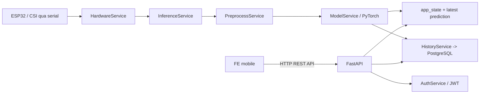

# Tong quan he thong ung dung

Tai lieu nay mo ta tong quan he thong hien tai gom 2 phan chinh: backend (BE) va frontend (FE). He thong duoc thiet ke de thu nhan du lieu CSI tu ESP32, xu ly du lieu theo thoi gian thuc, suy luan bang mo hinh PyTorch va cung cap giao dien di dong de theo doi trang thai, ket qua du doan, lich su va dang nhap nguoi dung.

## 1. Muc dich cua tung thanh phan

### Backend (BE)

BE la thanh phan trung tam xu ly va dieu khien cua he thong. BE co cac nhiem vu chinh:

- Nhan du lieu CSI tu ESP32 qua cong serial.
- Kiem tra, loc va tien xu ly du lieu truoc khi dua vao model.
- Chay suy luan bang model PyTorch de du doan trang thai hien dien.
- Luu ket qua du doan vao co so du lieu.
- Cung cap REST API va WebSocket de FE hoac client khac co the lay trang thai, lich su va ket qua moi nhat.

### Frontend (FE)

FE la ung dung mobile xay dung tren Expo Router + React Native. FE co vai tro:

- Hien thi dashboard trang thai he thong.
- Goi API BE de lay du lieu realtime, lich su du doan, trang thai monitoring va thong tin tai khoan.
- Dang ky, dang nhap, dang xuat nguoi dung.
- Luu access token trong AsyncStorage de su dung cho cac request can xac thuc.

## 2. Cong nghe su dung

### FE

- Expo Router
- React Native
- TypeScript
- Expo Constants de suy ra dia chi API
- AsyncStorage de luu JWT access token
- Zod de validate du lieu form

### BE

- FastAPI
- SQLAlchemy
- PostgreSQL
- PyTorch
- NumPy, SciPy
- PySerial de doc du lieu tu cong serial
- python-jose de tao va giai ma JWT

## 3. Kien truc tong the

## 4. Kien thuc giao tiep du lieu CSI tu ESP32 toi BE

Du lieu CSI duoc gui tu ESP32 ve BE qua ket noi serial. BE khong nhan du lieu thang tu FE, ma doc truc tiep tu port serial bang `HardwareService`.

### Quy trinh nhan du lieu

1. Khi BE khoi dong, `HardwareService` co the duoc bat tu dong neu bien moi truong `AUTO_START_MONITORING=true`, hoac duoc bat bang API `POST /api/control/start`.
2. `HardwareService` mo cong serial theo `SERIAL_PORT` va toc do truyen `SERIAL_BAUDRATE`.
3. Moi dong du lieu duoc doc, decode ve chuoi, sau do tach thanh:
   - `device_id`
   - danh sach gia tri CSI dang so thuc
4. Neu so luong gia tri nho hon `feature_dim`, goi du lieu bi tu choi.
5. Neu so luong gia tri lon hon `feature_dim`, BE cat ve dung so feature can thiet.
6. Du lieu hop le duoc day sang `InferenceService` de dua vao buffer va chu ky suy luan.

### Kiem tra va loc packet

BE co cac chi so thong ke de theo doi chat luong du lieu:

- `received_packets`
- `accepted_packets`
- `rejected_packets`
- thoi diem packet cuoi cung
- trang thai ket noi serial

Day la co so de quan sat duong truyen CSI co on dinh hay khong.

## 5. Kien thuc BE xu ly va nhan du lieu

### 5.1 Buffer va cua so du doan

`InferenceService` su dung co che buffer theo cua so:

- `window_size`: so mau can co truoc khi du doan
- `step_size`: so mau moi can them de kich hoat lan du doan tiep theo

Khi buffer chua du `window_size`, he thong chi luu mau, chua suy luan. Khi buffer day va da co du so mau moi theo `step_size`, backend moi chay mot vong du doan.

### 5.2 Tien xu ly du lieu

Truoc khi dua vao model, du lieu duoc xu ly boi `PreprocessService`:

1. Hampel filter: giam outlier trong tin hieu.
2. Butterworth low-pass filter: lam muot du lieu.
3. Standardization: su dung `standardizer_mu` va `standardizer_sigma` neu checkpoint co luu.
4. Global normalization: su dung `global_max_abs` neu co.
5. Neu model type la `cnn2d`, du lieu co the duoc chuyen thanh spectrogram truoc khi dua vao model.

### 5.3 Suy luan bang model

`ModelService` load checkpoint `models/lstmcnn.pt` khi backend khoi dong. Tu checkpoint, he thong co the suy ra:

- `model_type`
- `window_size`
- `step_size`
- `feature_dim`
- so lop phan loai
- ten nhan neu checkpoint co `class_names`

Khi suy luan:

1. Du lieu da tien xu ly duoc chuyen thanh tensor PyTorch.
2. Model tra ve logits.
3. Softmax duoc dung de tinh xac suat tung lop.
4. BE chon lop co xac suat cao nhat va tra ve ket qua gom:
   - `presence`
   - `confidence`
   - `probability` / `probabilities`

### 5.4 Luu ket qua va trang thai

Sau moi lan du doan thanh cong:

- Ket qua duoc luu vao `app_state.latest_prediction`.
- `app_state.model_loaded` duoc cap nhat.
- Ket qua duoc luu vao bang `prediction_history` trong PostgreSQL thong qua `HistoryService`.
- Neu co WebSocket, BE co the thong bao ket qua moi nhat cho client dang ket noi.

## 6. Kien thuc giao tiep giua BE va FE

FE giao tiep voi BE bang HTTP REST API, du lieu tra ve dang JSON. Moi request de lam viec voi cac API can xac thuc se kem `Authorization: Bearer <token>` sau khi nguoi dung dang nhap thanh cong.

### Cach FE xac dinh dia chi BE

Frontend `services/api.ts` uu tien theo thu tu:

1. Bien moi truong `EXPO_PUBLIC_API_BASE_URL`.
2. `extra.apiBaseUrl` trong cau hinh Expo.
3. Host runtime tu Expo neu dang chay tren dien thoai/emulator.
4. Dia chi mac dinh `http://127.0.0.1:8000/api` neu khong tim thay cau hinh nao khac.

### Cach FE xu ly request

- FE tu dong them header `Content-Type: application/json`.
- Neu da co access token, FE tu dong them `Authorization`.
- FE co co che timeout request de tranh treo ung dung.
- FE chuan hoa du lieu prediction ve mot format thong nhat truoc khi hien thi.

### Luong realtime tren FE

Man hinh Home cua FE dang thuc hien cac buoc:

1. Goi `GET /api/status` de lay trang thai backend va trang thai monitoring.
2. Goi `GET /api/latest` de lay ket qua du doan moi nhat.
3. Poll dinh ky de cap nhat trang thai lien tuc.
4. Cho phep nguoi dung bat hoac tat monitoring qua API control.

## 7. Chuc nang cac API chinh

### `GET /api/status`

Tra ve trang thai tong quan cua he thong, bao gom:

- backend dang chay hay khong
- model da load chua
- `model_type`, `window_size`, `step_size`, `input_shape`, `feature_dim`
- trang thai monitoring
- ket qua du doan gan nhat
- thong ke ket noi serial va packet

### `GET /api/latest` va `GET /api/lastest`

Tra ve prediction moi nhat trong `app_state.latest_prediction`. Neu chua co du lieu, API tra ve thong bao `No data available`.

### `POST /api/predict`

Nhan mot cua so CSI co san duoi dang mang 2 chieu `window`, sau do:

- kiem tra dau vao
- tien xu ly du lieu
- goi model de du doan
- tra ve ket qua prediction

API nay phu hop khi client khac muon gui du lieu co san thay vi phu thuoc vao dong serial realtime.

### `POST /api/control/start`

Bat dau monitoring, mo ket noi serial va khoi dong vong doc du lieu.

### `POST /api/control/stop`

Dung monitoring, dong ket noi serial va ngung doc du lieu.

### `GET /api/history?limit=...`

Tra ve danh sach prediction da luu, sap xep theo thoi gian moi nhat, gioi han boi tham so `limit`.

### `POST /api/auth/register`

Tao tai khoan moi. Backend kiem tra email hop le, mat khau va xac nhan mat khau, sau do luu nguoi dung vao database.

### `POST /api/auth/login`

Xac thuc email va mat khau. Neu hop le, backend tra ve JWT access token va thong tin nguoi dung co ban.

### `GET /api/auth/user/me`

Tra ve thong tin nguoi dung hien tai dua tren JWT Bearer token.

## 8. Database

He thong hien tai su dung PostgreSQL. Cac bang chinh trong backend:

### `users`

Luu thong tin tai khoan nguoi dung:

- `id`: khoa chinh
- `email`: email duy nhat
- `full_name`: ho va ten, co the null
- `password_hash`: mat khau da bam
- `created_at`: thoi gian tao

### `prediction_history`

Luu lich su du doan:

- `id`: khoa chinh
- `payload`: du lieu JSON cua ket qua du doan
- `created_at`: thoi gian tao ban ghi

### Cach luu du lieu

- Du lieu prediction sau moi lan suy luan duoc luu vao `prediction_history`.
- Du lieu dang nhap va dang ky duoc luu trong `users`.
- Mat khau khong luu dang ro, ma duoc bam bang PBKDF2-HMAC-SHA256.

## 9. Tom tat chu trinh hoat dong

1. BE khoi dong, load model va database.
2. HardwareService mo cong serial va doc CSI tu ESP32.
3. Du lieu hop le duoc dua vao buffer va tien xu ly.
4. Model PyTorch suy luan ket qua hien dien.
5. Ket qua du doan duoc luu vao app state va database.
6. FE goi API de hien thi trang thai, ket qua moi nhat va lich su.
7. Nguoi dung co the dang nhap, dang ky va dieu khien monitoring tu FE.

## 10. Ket luan

He thong hien tai la mot mo hinh client-server ro rang: BE chiu trach nhiem thu nhan, xu ly va suy luan du lieu CSI; FE tap trung vao hien thi, tuong tac va truy cap du lieu thong qua API. Cach tach nay giup he thong de bao tri, de mo rong va phu hop cho cac tinh nang giam sat realtime trong tuong lai.